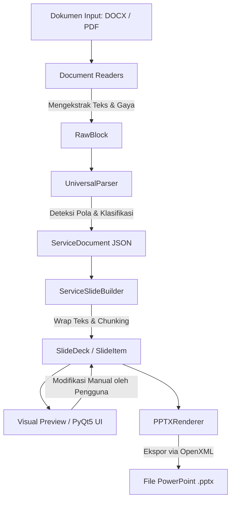

# Dokumentasi Analisis Sistem: LiturgiSlide (Slide Ibadah Generator)

Dokumen ini berisi analisis mendalam mengenai arsitektur, data flow, struktur komponen, fitur-fitur, serta status pengujian sistem **LiturgiSlide (Slide Ibadah Generator)**. Aplikasi ini dirancang khusus untuk memproses dokumen tata ibadah gereja (terutama dalam format GMIM - Gereja Masehi Injili di Minahasa) menjadi file PowerPoint (.pptx) siap tampil secara semi-otomatis.

---

## 1. PENDAHULUAN & TUJUAN SISTEM

Proses penyusunan slide presentasi liturgi ibadah gereja secara manual memerlukan waktu dan ketelitian yang tinggi—mulai dari memisahkan bagian liturgi pembacaan dialog antara Pelayan (P) dan Jemaat (J), memotong lirik lagu yang panjang agar tidak meluap (*overflow*) dari layar proyektor, hingga memformat warna teks speaker yang berbeda agar mudah dibaca oleh jemaat.

**LiturgiSlide** menyelesaikan masalah ini dengan menyediakan pipeline semi-otomatis:
- **Otomatisasi 80–90%**: Ekstraksi metadata, pengelompokan jenis slide, pembagian baris teks, pewarnaan speaker (P/J/P+J), dan pengaturan aspek rasio slide dilakukan secara otomatis.
- **Kontrol Manual 10–20%**: Pengguna dapat meninjau hasil parsing, melakukan edit teks, memindahkan urutan slide, menggandakan (*duplicate*), menghapus (*delete*), serta memecah (*split*) atau menggabungkan (*merge*) slide sebelum akhirnya diekspor ke file PowerPoint.

---

## 2. ARSITEKTUR & DATA FLOW

Sistem telah bermigrasi dari pendekatan langsung (`DOCX → PPTX`) yang kaku ke pendekatan modern berbasis **Data Layer Perantara (JSON)** yang fleksibel. Pipeline pengolahan dokumen berjalan secara linear sebagai berikut:

### Penjelasan Langkah Pipeline:
1. **Document Readers (`core/readers.py`)**: Membaca file fisik (`.docx` atau `.pdf`) dan mengonversinya menjadi daftar objek perantara bernama `RawBlock`.
2. **UniversalParser (`core/universal_parser.py`)**: Mengklasifikasikan `RawBlock` berdasarkan heuristik teks, regex, dan pencocokan kata kunci (*keyword matching*), lalu mengelompokkannya ke dalam struktur tata ibadah `ServiceDocument`.
3. **ServiceSlideBuilder (`core/slide_builder.py`)**: Menerapkan aturan pemotongan teks aman (melalui `core/text_splitter.py`) untuk mengubah dokumen ibadah menjadi lembaran slide individual (`SlideItem`) yang tergabung dalam `SlideDeck`.
4. **Visual Preview / PyQt5 UI (`ui/`)**: Menyajikan daftar slide kepada pengguna lengkap dengan rendering persis piksel sesuai aspek rasio (1:1 Square, 16:9 Landscape, 4:3 Standard) dan template warna. Di sini pengguna bisa melakukan koreksi manual.
5. **PPTXRenderer (`core/renderers.py`)**: Menggunakan pustaka `python-pptx` untuk membuat file PowerPoint riil dengan transisi (termasuk Morph), penempatan teks absolut untuk cover, pewarisan background, dan struktur grup menu PowerPoint (*Sections*).

---

## 3. DETAIL KOMPONEN UTAMA

### 3.1 Data Layer (`core/models.py`)

Aplikasi menggunakan dataclass Python untuk merepresentasikan struktur data secara formal:
- **`SlideType` (Enum)**: Masing-masing slide diklasifikasikan ke tipe tertentu:
  - `COVER`: Slide pembuka ibadah.
  - `NOTICE` / `START`: Instruksi jemaat (misal: "Jemaat berdiri", "Saat Teduh").
  - `SECTION`: Judul bab besar ibadah (misal: "PERSIAPAN", "PELAYANAN FIRMAN").
  - `SONG_TITLE` / `SONG_LYRICS`: Judul dan lirik lagu (KJ, NKB, PKJ, NNBT, dll.).
  - `LITURGY_DIALOG`: Dialog responsif liturgi (P/J/P+J).
  - `PRAYER`, `BIBLE_READING`, `SERMON`, `OFFERING`, `ANNOUNCEMENT`, `BLESSING`, `CLOSING`, `BLANK`.
- **`ServiceDocument`**: Objek tingkat atas yang menyimpan metadata ibadah (tema mingguan/bulanan, nama gereja, khadim, tanggal, bacaan Alkitab), daftar bagian (`ServiceSection`), dan modul sakramen/acara khusus.
- **`SlideItem`**: Merepresentasikan satu buah slide PowerPoint. Menyimpan teks konten, speaker lines kustom, path background gambar/warna, status apakah diikutsertakan (`include`), serta koordinat absolut khusus layout cover.
- **`SlideDeck`**: Kontainer koleksi `SlideItem` yang menyimpan konfigurasi rasio aspek, nama preset liturgi, dan nama template aktif.

### 3.2 Document Readers & Heuristic Extractor (`core/readers.py`)

- **`DOCXReader`**: Mengurai dokumen Word paragraf demi paragraf, mengekstrak properti gaya seperti nama style, ukuran font terbesar dalam paragraf, status cetak tebal (*bold*), perataan teks (*alignment*), dan rasio huruf kapital.
- **`PDFReader` & `OCRReader`**: Membaca teks dari PDF berbasis teks menggunakan PyMuPDF (`fitz`). Jika PDF berupa gambar hasil scan (tidak menghasilkan teks murni), sistem secara cerdas memberikan pesan peringatan dan menawarkan opsi **OCR Fallback** menggunakan Tesseract OCR untuk membaca halaman demi halaman.
- **Heuristic Extractor**: Fungsi `extract_cover_title_from_docx` and `extract_cover_title_from_pdf` mengevaluasi halaman pertama dokumen untuk menebak judul liturgi dengan memberi bobot visual terbesar pada elemen teks (ukuran font terbesar, huruf kapital penuh, dan cetak tebal).

### 3.3 Universal Parser & Major Section Filter (`core/universal_parser.py`)

Universal Parser melakukan pemindaian terpadu:
- **Filter Major Section (QoL V3)**: Agar daftar slide tidak dipenuhi oleh section-section kecil dari setiap instruksi menyanyi (misal: "Menyanyi KJ No. 14" yang sebelumnya terdeteksi sebagai section baru), parser menguji teks judul bagian menggunakan filter `_is_major_section`.
  - Teks diverifikasi terhadap daftar `MAJOR_SECTION_KEYWORDS` standar GMIM (seperti `PERSIAPAN`, `TAHBISAN`, `PENGAKUAN DOSA`, `PERSEMBAHAN`, `BERKAT`).
  - Teks yang mengandung kata seperti "Menyanyi" atau kode buku lagu ("KJ", "NKB", "PKJ", "NNBT") akan ditolak sebagai section baru.
  - Teks judul bagian utama dibersihkan dari keterangan dalam kurung (misalnya: `"DOA SYUKUR (Jemaat berdiri)"` menjadi `"Doa Syukur"`) dan dikonversi menjadi *Title Case* agar rapi di panel navigasi.
  - Sub-heading atau lagu yang berada di bawah section tersebut otomatis dikelompokkan ke dalam bagian besar yang sedang aktif.

### 3.4 Slide Builder & Text Splitter (`core/slide_builder.py`, `core/text_splitter.py`)

Pemberian teks panjang (seperti doa panjang atau lirik lagu 8 bait) ditangani agar tidak meluap dari batas layar proyektor:
- **Visual Line Wrapping (`wrap_text_to_visual_lines`)**: Menggunakan algoritma pembungkus kata (*word wrap*) untuk memotong teks menjadi baris-baris visual tanpa memotong kata di tengah.
- **Kalkulasi Lebar Baris Dinamis (`max_chars_for_style`)**: Jumlah karakter maksimal per baris dihitung secara matematis berdasarkan **ukuran font** dan **aspek rasio slide** yang dipilih (slide widescreen 16:9 menampung lebih banyak karakter per baris daripada slide square 1:1).
- **Chunking Teks (`split_visual_lines_to_chunks`)**: Memecah daftar baris teks menjadi beberapa slide terpisah dengan batas aman baris per slide (`max_lines_per_slide`, default: 6 baris).
- **Liturgy Dialog Wrapper**:
  - Untuk slide liturgi dialog, pembacaan speaker kontinu yang terpisah paragraf digabungkan kembali (`_merge_speaker_continuations`).
  - Baris dibungkus dengan menyisipkan identitas speaker di awal (misal: `"P : Tuhan sertamu"`). Jika teks dialog tersebut dipecah ke slide berikutnya, sistem akan secara otomatis mewariskan identitas speaker yang sedang aktif di slide baru tersebut agar jemaat tidak bingung siapa yang sedang berbicara.

### 3.5 Template Engine (`core/template_engine.py`, `core/template_manager.py`)

Aplikasi memisahkan data teks dari penata gaya desain menggunakan template berbasis JSON (misalnya `templates/gmim_default.json`):
- Peta gaya menentukan properti default seperti font family, ukuran font, warna teks, margin, perataan teks (kiri, tengah, kanan), perataan vertikal (atas, tengah), dan bayangan teks (*text shadow*).
- **Speaker Colors**: Mengatur warna khusus berdasarkan speaker yang didefinisikan dalam template (misalnya Jemaat `J` dan gabungan Pelayan+Jemaat `P+J` berwarna kuning `#F2C94C`, sedangkan Pelayan `P` berwarna putih `#FFFFFF`).
- Aturan penyelesaian gaya (`TemplateResolver.resolve`):
  1. Menggunakan gaya default template.
  2. Menerapkan penimpaan (*override*) gaya berdasarkan tipe slide (`SlideType`).
  3. Menerapkan penimpaan gaya berdasarkan section yang aktif.
  4. Menerapkan konfigurasi metadata kustom pada slide individual yang diedit langsung oleh pengguna di UI.

### 3.6 PyQt5 UI Desktop (`ui/`)

- **MainWindow (`ui/main_window.py`)**:
  - **Panel Kiri**: Upload dokumen tata ibadah dan opsi pengubahan parameter global (font family per tipe slide, ukuran font, tipe transisi, pilihan template, aspek rasio, dan preset GMIM).
  - **Panel Tengah (Slide List & Focus Preview)**: Menampilkan list thumbnail slide interaktif dengan checkbox untuk menyertakan/mengabaikan slide dalam ekspor. Di bagian preview utama, slide digambar menggunakan painter vektor PyQt5 (`VisualSlidePreviewWidget`) sehingga visualnya sama persis dengan output PowerPoint.
  - **Panel Kanan (Editor)**: Mengedit isi teks, tipe slide, alignment, template kustom, dan menandai awal section baru (*Set as Section Start*). Menyediakan tombol operasi cepat: *Duplicate*, *Delete*, *Split*, *Merge*, *Move Up/Down*.
- **Interactive Cover Designer (`ui/cover_editor.py`)**:
  - Wizard WYSIWYG interaktif berbasis `QGraphicsScene` and `QGraphicsView`.
  - Pengguna dapat menggeser posisi judul cover (*drag and drop*), mengatur warna teks, memilih font, dan mengimpor gambar latar belakang.
  - **Save/Load Preset JSON (QoL V5)**: Memungkinkan pengguna menyimpan konfigurasi posisi teks, jenis huruf, warna, dan gambar background cover ke file `.json`, sehingga layout cover yang cantik dapat dimuat kembali pada minggu berikutnya tanpa mendesain ulang dari nol.
- **Fullscreen Preview (`ui/fullscreen_preview.py`)**:
  - Menampilkan slide layar penuh menggunakan keyboard panah (kiri/kanan) untuk berpindah slide, mensimulasikan operator multimedia saat ibadah berlangsung.

### 3.7 PowerPoint Exporter (`core/renderers.py`)

`PPTXRenderer` menerjemahkan data `SlideItem` menjadi file PowerPoint asli:
- **Absolute Cover Layout**: Jika slide ditandai `is_absolute_layout = True` (yaitu slide Cover), koordinat penempatan kotak teks dikonversi dari koordinat relatif UI (0.0 - 1.0) menjadi Inches fisik PowerPoint, lalu digambar langsung bersama gambar latar belakang.
- **Speaker Alignment & Formatting**:
  - Menulis baris dialog dengan format berbeda: nama speaker dicetak tebal (`bold=True`), dan warna teks mengikuti konfigurasi speaker (misal: dialog Jemaat secara otomatis diletakkan rata kanan dengan warna kuning).
- **Efek Transisi**: Mendukung penulisan tag XML tingkat rendah OpenXML ke file presentasi untuk menerapkan transisi slide: *Fade*, *Wipe*, *Push*, *Zoom*, dan *Morph*.
- **Injeksi XML Section (`_inject_sections`)**:
  - Mengelompokkan slide berdasarkan section namanya secara berurutan.
  - Memasukkan elemen ekstensi `<p:extLst>` dan `<p14:sectionLst>` ke dalam struktur XML dokumen presentasi (`presentation.xml`).
  - Hasilnya, saat PowerPoint dibuka di Microsoft PowerPoint, slide sudah terbagi dalam folder-folder bab (*Sections*) yang rapi, memudahkan operator mencari bagian ibadah tertentu.

---

## 4. ALUR FITUR SPESIFIK & QUALITY OF LIFE (QoL)

### 4.1 Re-Editor Cover
Pada versi awal, cover hanya bisa didesain sekali saat dokumen diunggah. Versi terbaru (V5) mengintegrasikan tombol **"🎨 Edit Tata Letak Cover"** di panel editor MainWindow. Tombol ini hanya muncul jika slide aktif yang dipilih adalah tipe `COVER`. Pengguna dapat memanggil ulang dialog wizard interaktif untuk merevisi teks cover, mengubah posisinya, atau mengganti gambar latar secara langsung di tengah-tengah proses editing slide.

### 4.2 Pewarisan Background Section (Background Inheritance)
Untuk mencegah pengguna harus mengunggah gambar latar belakang secara manual ke puluhan slide satu per satu, sistem menerapkan **pewarisan otomatis**:
1. Pengguna cukup menetapkan gambar latar belakang pada slide judul bagian utama (tipe `SECTION`).
2. Semua slide isi (lirik lagu, liturgi, doa) yang berada di bawah section tersebut secara otomatis mewarisi gambar background, warna background, serta opacity overlay dari section tersebut.
3. Pewarisan ini terus berlaku hingga sistem mendeteksi slide section baru, di mana background akan diatur ulang (*reset*) atau mengikuti background baru dari section berikutnya.

---

## 5. ANALISIS STATUS PENGUJIAN & KEPATUHAN KODE

Aplikasi memiliki rangkaian uji coba unit (*unit tests*) yang komprehensif di folder `tests/` dengan total **85 kasus uji**. 

Saat pengujian dijalankan via `pytest`, terdapat **82 passed** dan **3 failed**. Berikut adalah analisis kegagalan pengujian tersebut:

### 5.1 Detail Unit Test yang Gagal

1. **`tests/test_parser_pipeline.py::test_parser_detects_song_title_and_lyrics`**
   - **Penyebab**: Pengujian ini mengharapkan slide lirik lagu memiliki atribut `section` yang bernilai sama dengan judul lagunya (misalnya `"Menyanyi KJ 1 Haleluya"`). Namun, sejak implementasi **Major Section Filter (V3)**, lagu tidak lagi memicu pergantian section baru. Atribut section slide lirik tetap menggunakan nama section utama sebelumnya (dalam hal ini, defaultnya `"Cover"`).
   - **Status**: Kegagalan ini membuktikan bahwa kode filter Major Section berfungsi dengan benar sesuai spesifikasi baru, namun file uji coba ini masih menggunakan asumsi lama dan perlu diperbarui.

2. **`tests/test_universal_parser.py::test_universal_parser_outputs_service_document_json`**
   - **Penyebab**: Pengujian mengharapkan judul section yang tersimpan di `ServiceDocument` bernilai huruf kapital penuh sesuai dokumen asli (`"PEMBUKAAN"`). Namun, implementasi V3 sengaja melakukan pembersihan dan standardisasi casing teks menjadi Title Case (`"Pembukaan"`) agar tampilan slide rapi.
   - **Status**: Perilaku kode saat ini sudah benar dan estetis, kasus uji yang perlu disesuaikan asertinya menjadi `"Pembukaan"`.

3. **`tests/test_universal_parser.py::test_parse_blocks_uses_service_document_before_slide_deck`**
   - **Penyebab**: Sejak parser mengelompokkan blok liturgi ke dalam section teratur, sistem menyisipkan objek `ServiceSection` default bernama `"Tata Ibadah"` jika tidak menemukan section utama di awal liturgi. Oleh karena itu, `ServiceSlideBuilder` menambahkan slide pemisah bertipe `SlideType.SECTION` dengan nama `"Tata Ibadah"` di awal daftar slide. Pengujian ini gagal karena tidak mengantisipasi keberadaan slide section tambahan ini di indeks 2.
   - **Status**: Perilaku sistem sudah konsisten dengan arsitektur baru yang terstruktur. Kasus uji perlu disesuaikan untuk memasukkan slide section baru tersebut dalam asertinya.

---

## 6. KESIMPULAN

Sistem **LiturgiSlide** merupakan aplikasi pembuat slide liturgi ibadah yang sangat matang secara arsitektur. Pemisahan tanggung jawab antara pembaca dokumen (`readers`), parser semantik (`UniversalParser`), pembangun tata letak (`ServiceSlideBuilder`), visualisasi antarmuka (`ui`), dan pengekspor PowerPoint (`PPTXRenderer`) membuat codebase ini sangat modular, mudah dirawat, dan dikembangkan lebih lanjut.

Fitur QoL seperti **Interactive Cover Designer**, **Preset JSON Management**, **Major Section Filter**, dan **Background Inheritance** memberikan kenyamanan maksimal bagi operator gereja GMIM Syaloem dalam mempersiapkan slide ibadah hari Minggu secara cepat, rapi, dan konsisten.
